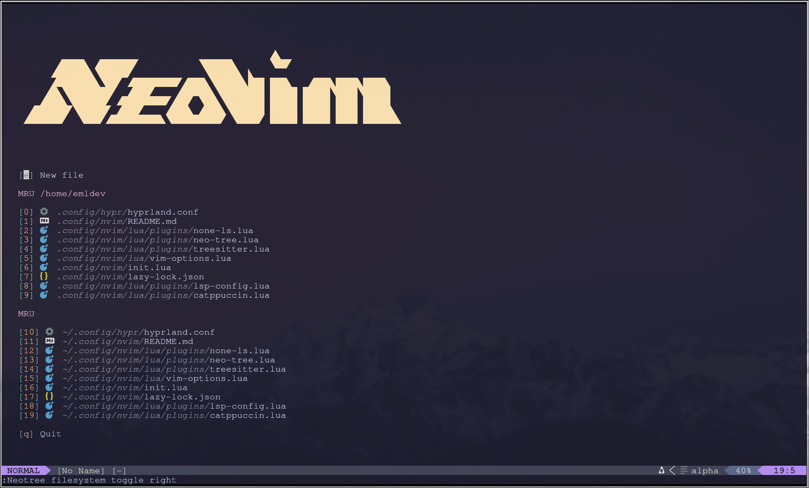
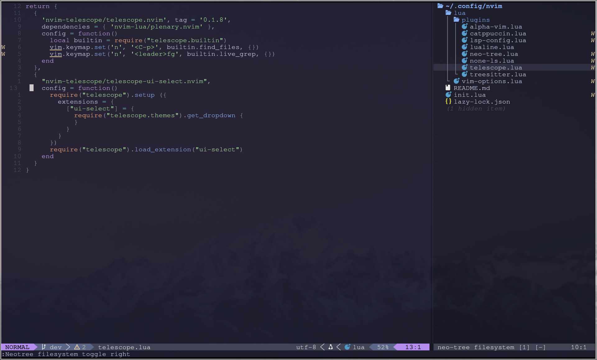

# Emldev's basic Nvim config
This is my base config for Neovim, I'm no expert as I'm currently learning the basics
but I love to share what I learn with others.

This is the basic config, it doesn't include any lsp / linter / formatter. It's mainly a quality of life basic setup for nvim. Checkout the `dev` branch to try out my current developpment build.

## Dependencies
Neovim 0.11+

The following commands are ran on `Arch` using the `pacman` package manager,
adapt them for your system.

C compiler for lua ( usually included in basics package ): `sudo pacman -Syu --needed base-devel`

Any decent nerd-fonts, I use `ttf-jetbrain-mono-nerd`

## Installation
Clone this repo in `/~/.config/`

Launch `nvim`

Voilà!

To uninstall, simply remove the `/~/.config/nvim/` directory.

## Screenshots

## Plugins
This config contains the following plugins

| Plugin | Description |
|--------|-------------|
| Lazy.nvim|Plugin manager|
| alpha-vim|Nvim splash screen|
| catppuccin|Sets the colorscheme|
| lualine| Pretty line at the bottom of your screen|
| neo-tree| Toggleable file tree for the pwd |
| telescope.nvim| Displays the Live Grep and Find File for the pwd |
| nvim-treesitter| Highlights code syntax like [ { ( ) } ] |

## Keybinds
Some basic keybinds / keymaps to know in this setup, all executed in "Normal" mode

|Keybind| Description|
|---|---|
|`<leader>`nvim| Set the pwd to /~/.config/nvim |
|`<C-n>`| Toggle the file tree on the right |
|`<C-p>`| Fuzzy find a file in the pwd |
|`<leader>`fg | Live Grep through files in the pwd |
|`<C-w>`|Switch between the editor window and the file tree |

## How does it work?
Basically, Neovim has a lua runtime in the background enabling us to execute code.

Using the Lazyvim framework, the `init.lua` file is read and fetches a list of plugins to install.

It does so by adding up each return statement within the files under `.../lua/plugins/`

## Sources
For the majority of the basics, I followed the great teachings of typecraft_dev on youtube.

He has a great [playlist](https://www.youtube.com/watch?v=zHTeCSVAFNY&list=PLsz00TDipIffreIaUNk64KxTIkQaGguqn) explaining really well each steps.
